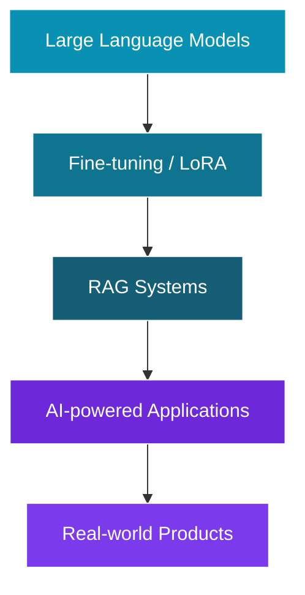

<div align="center">


<a href="https://github.com/harendrasijapati2012">
  
</a>


&nbsp;
<a href="https://github.com/harendrasijapati2012?tab=followers">
  
</a>

</div>

<br/>

## 🧑‍💻 About Me

```yaml
name:      Harendra Sijapati
role:      Full Stack Software Developer
location:  Nepal 🇳🇵

focus:
  - Full Stack Development
  - Backend Architecture & REST APIs
  - AI & Machine Learning
  - Mobile Applications

currently_building:
  - 🇳🇵 Loksewa PSC Nepal App
  - 🤖 AI-powered learning systems
  - ⚙️  Scalable backend services

fun_fact: "Code → Learn → Build → Improve → Repeat 🚀"
```

<table>
<tr>
<td>

🚀 **Building** → Full-stack applications & scalable backend systems
🎯 **Focused on** → Backend architecture, REST APIs & system design
🤖 **Exploring** → AI, Machine Learning, LLMs & RAG
📱 **Developing** → Web and Flutter mobile applications
🐳 **Working with** → Docker, Linux, PostgreSQL, Redis & Celery
💬 **Ask me about** → Python, Django, FastAPI, React, Flutter & APIs

</td>
</tr>
</table>

<br/>

## 🚀 Featured Projects

<table>
  <tr>
    <td width="50%" valign="top">
      <h3 align="center">🇳🇵 Loksewa PSC App</h3>
      <p align="center">A complete learning and exam preparation platform for Nepal Loksewa candidates.</p>
      <p align="center">
        
        
        
        
      </p>
    </td>
    <td width="50%" valign="top">
      <h3 align="center">🎓 College Finder</h3>
      <p align="center">A platform that helps students discover, search and compare colleges and academic programs.</p>
      <p align="center">
        
        
        
        
      </p>
    </td>
  </tr>
  <tr>
    <td width="50%" valign="top">
      <h3 align="center">🤖 Loksewa AI</h3>
      <p align="center">AI-powered educational assistant designed to help students prepare for Loksewa examinations.</p>
      <p align="center">
        
        
        
        
      </p>
    </td>
    <td width="50%" valign="top">
      <h3 align="center">💰 Wallet & Reward System</h3>
      <p align="center">Backend system for wallets, transactions, rewards, referrals and user balances.</p>
      <p align="center">
        
        
        
        
      </p>
    </td>
  </tr>
</table>

<br/>

## 🛠️ Skills & Tools

<div align="center">

**💻 Languages**
<br/>


**⚙️ Backend**
<br/>


**🎨 Frontend & Mobile**
<br/>


**🗄️ Database & Caching**
<br/>


**🐳 DevOps & Tools**
<br/>


**🤖 AI & Machine Learning**
<br/>


</div>

<br/>

### 🧭 Currently Exploring



<br/>

## 📊 GitHub Stats

<div align="center">
  
  
</div>

<div align="center">
  
</div>

<div align="center">
  
</div>

<br/>

## 🐍 Contribution Snake

> An animated version of the contribution graph, generated from real commit history by a GitHub Action.

<div align="center">
  <picture>
    <source media="(prefers-color-scheme: dark)" srcset="https://raw.githubusercontent.com/harendrasijapati2012/harendrasijapati2012/output/github-contribution-grid-snake-dark.svg"/>
    <source media="(prefers-color-scheme: light)" srcset="https://raw.githubusercontent.com/harendrasijapati2012/harendrasijapati2012/output/github-contribution-grid-snake.svg"/>
    
  </picture>
</div>

<details>
<summary>⚙️ How to set up the animated snake (click to expand)</summary>

<br/>

This snake is powered by the official `Platane/snk` GitHub Action — it renders your **real** contribution graph as an animation, it isn't fabricated data. To enable it on your own profile repo:

1. Create `.github/workflows/snake.yml` in your `harendrasijapati2012/harendrasijapati2012` repo with:

```yaml
name: Generate Snake

on:
  schedule:
    - cron: "0 0 * * *"
  workflow_dispatch: {}
  push:
    branches: [ main ]

jobs:
  generate:
    permissions:
      contents: write
    runs-on: ubuntu-latest
    steps:
      - uses: Platane/snk@v3
        id: snake-gif
        with:
          github_user_name: harendrasijapati2012
          outputs: |
            dist/github-contribution-grid-snake.svg
            dist/github-contribution-grid-snake-dark.svg?palette=github-dark

      - uses: crazy-max/ghaction-github-pages@v4
        with:
          target_branch: output
          build_dir: dist
        env:
          GITHUB_TOKEN: ${{ secrets.GITHUB_TOKEN }}
```

2. Commit and push — the Action runs daily and on every push, regenerating the SVG from your actual commit graph.
3. The `<picture>` block above automatically switches between light/dark versions to match the viewer's theme.

</details>

<br/>

## 🌐 Connect With Me

<div align="center">

<a href="https://github.com/harendrasijapati2012">
  
</a>
<a href="https://www.linkedin.com/">
  
</a>
<a href="mailto:YOUR_EMAIL@gmail.com">
  
</a>

</div>

<br/>

<div align="center">

**🇳🇵 Building from Nepal, creating for the world.**

*Code → Learn → Build → Improve → Repeat 🚀*


</div>
